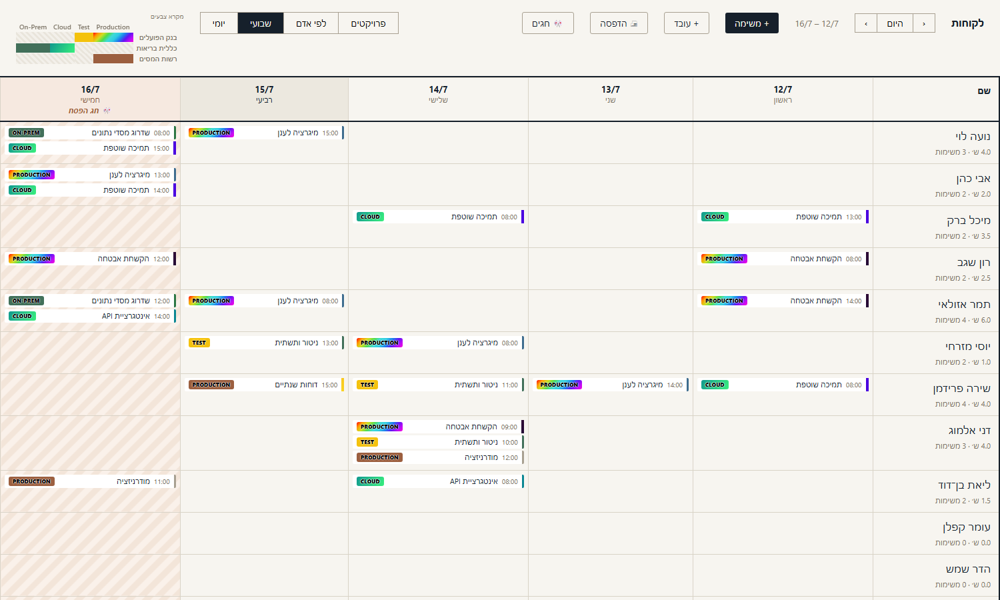
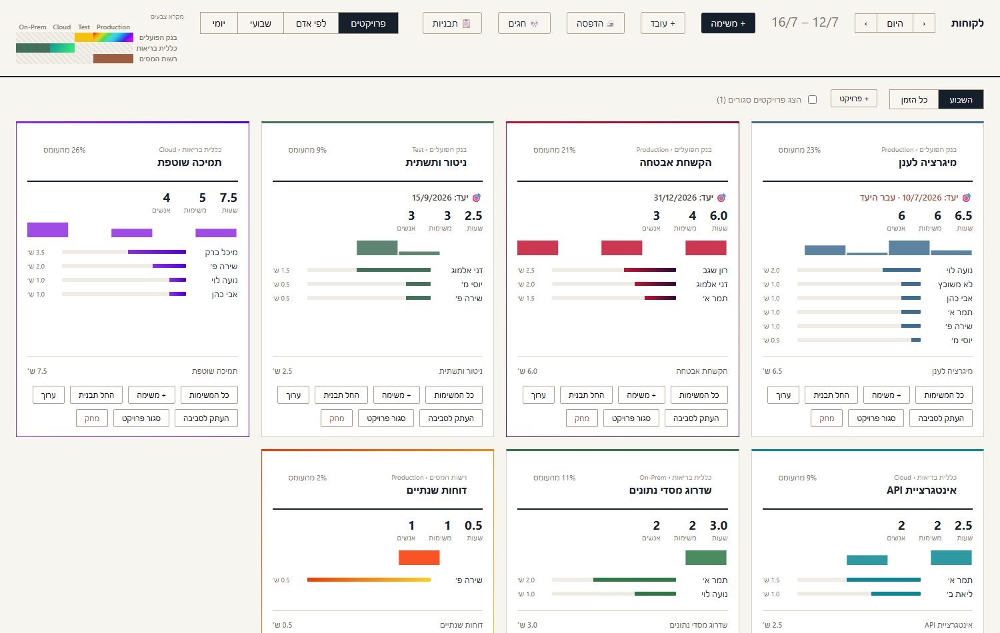
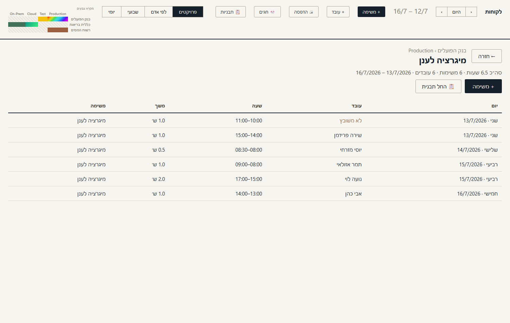
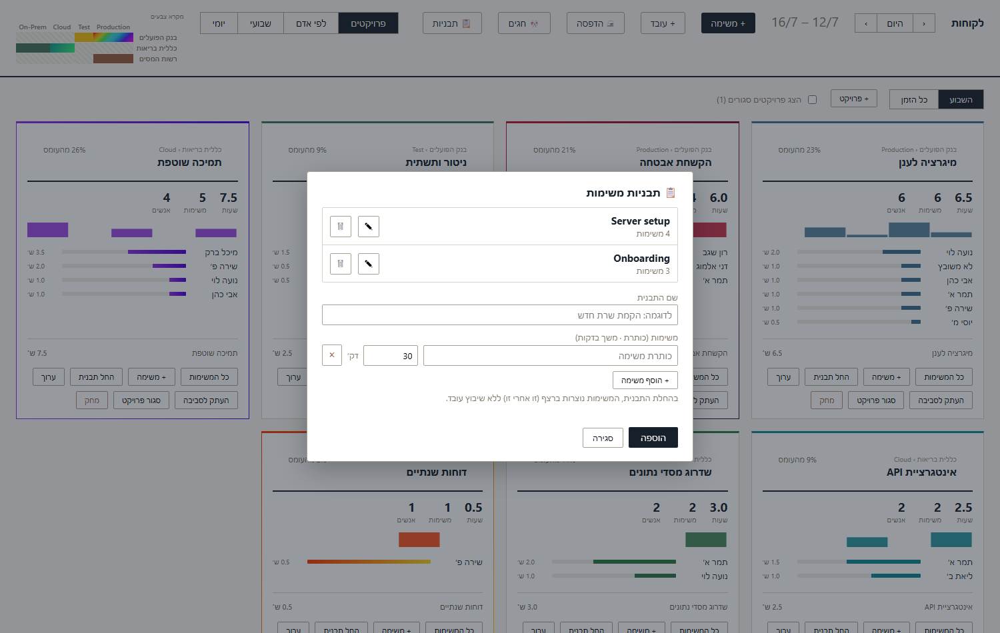
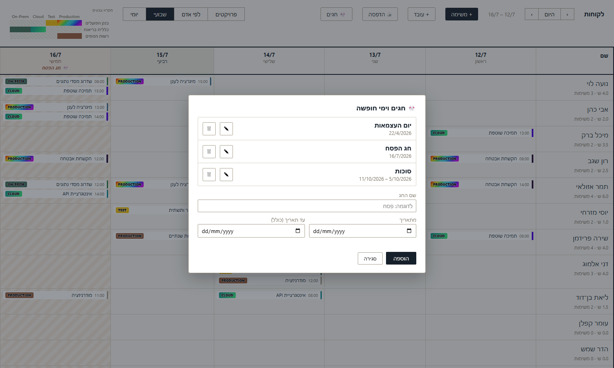
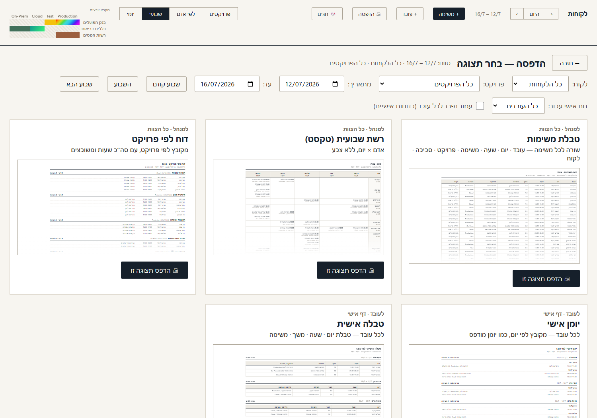

# TeamScheduler

A **weekly team task scheduler** for planning who works on what, across customers, environments and projects. It's a single-file HTML/JS front end backed by a small **Windows PowerShell 5.1** data/API layer that serves the UI and answers `/api/…` calls over HTTP on `localhost`.

The UI is **Hebrew / RTL**. Storage is plain local JSON files — **no database, no service, no installer, and no admin rights required.**



## Highlights

- **Weekly board** (Sun–Thu) with a color legend, per-person load totals, and drag-to-pan.
- **Four views** of the same data: weekly grid, daily timeline, projects portfolio, and per-person agenda.
- **Full entity management in the browser**: customers → environments → projects → tasks, plus a shared people list. Projects support **cross-environment dependencies** with schedule/missing warnings.
- **Project page** — click a project to see a full-page list of **every** task for it across all dates (day, person, time, duration, title).
- **Project deadlines** — give a project an optional target date; cards and the project page flag it as on-track, ⛔ overdue, or ⚠ at-risk, and any task scheduled past the deadline gets a ⏰ tag on its chip.
- **Weekend guard** — the workweek is Sun–Thu, so a task placed on Fri/Sat won't show on the board; the task editor warns you and asks to confirm before saving one.
- **Task templates** — a reusable library of task lists (title + duration); apply one to any project and it creates the tasks back-to-back, unassigned, from a start date/time.
- **Holidays** — mark national/company days off as name + date range; the board tints those days and the task editor warns you (but never blocks scheduling).
- **Print reports** — five B&W A4-landscape layouts (team table, weekly grid, by-project, personal agenda, personal table) over any date range.
- **Automatic backups** — every graceful shutdown (Ctrl+C) zips the data to `backups\backup_<timestamp>.zip`.
- **Fully offline / air-gapped** — no CDNs, web fonts, analytics, or outbound calls of any kind.

## Screenshots

**Projects portfolio** — per-project load, dependencies, and deadline badges (on-track / overdue / at-risk).



**Project page** — click a project to see every task for it across all dates.



**Task templates** — a reusable library of task lists; apply one to any project.



**Holidays manager** — global holidays as name + date range; edit or delete inline.



**Print — choose a layout** — live-preview cards for each report, filtered by scope and date range.



## Run

From the `TeamScheduler/` folder, in a **non-admin** PowerShell:

```powershell
powershell -ExecutionPolicy Bypass -File .\Run-Scheduler.ps1                 # port 8770, opens the browser
powershell -ExecutionPolicy Bypass -File .\Run-Scheduler.ps1 -Port 8771 -NoBrowser
```

The browser opens `http://localhost:8770/`. Stop with **Ctrl+C**.

## Why no admin is needed

- **HTTP:** `System.Net.HttpListener` binds the literal prefix `http://localhost:PORT/`. Windows special-cases `localhost` so a standard user can register it — no `netsh http add urlacl`, no elevation. If a port is taken, use another high port (`-Port 8771`).
- **Storage:** JSON under `%LOCALAPPDATA%\TeamScheduler\` (always user-writable). Dates are local `yyyy-MM-dd` (never UTC), and Hebrew round-trips as UTF-8 without a BOM.
- **Runtime:** Windows PowerShell 5.1 (`powershell.exe`) — no PowerShell 7 syntax, no modules that install to Program Files.

> The server listens on `localhost` only, so it's reachable from that PC alone. Exposing it to other computers on the network requires a one-time admin step (URL ACL + firewall) and has no authentication — see the note in the run instructions before doing so.

## More

- **Run instructions, the full API table, and using the module directly:** [`TeamScheduler/README.md`](TeamScheduler/README.md)
- **Architecture, conventions, and the load-bearing PowerShell 5.1 gotchas:** [`CLAUDE.md`](CLAUDE.md)
